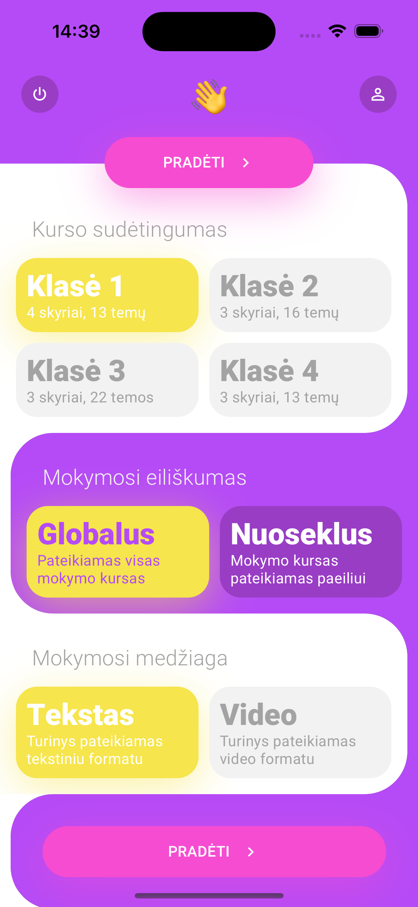
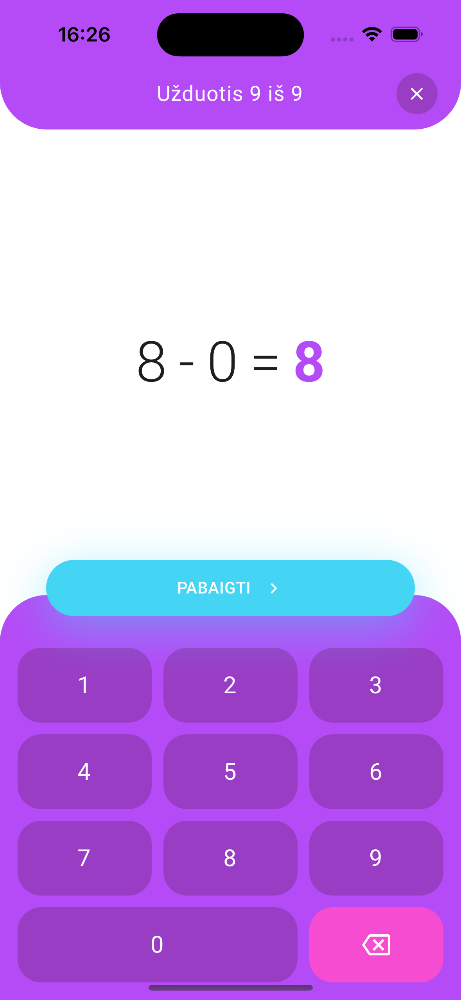
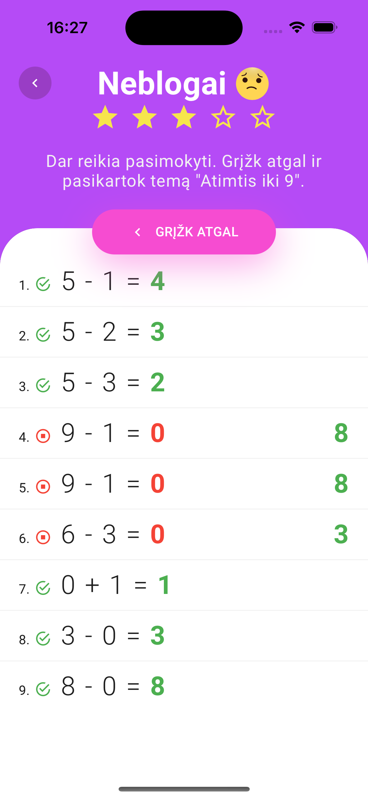
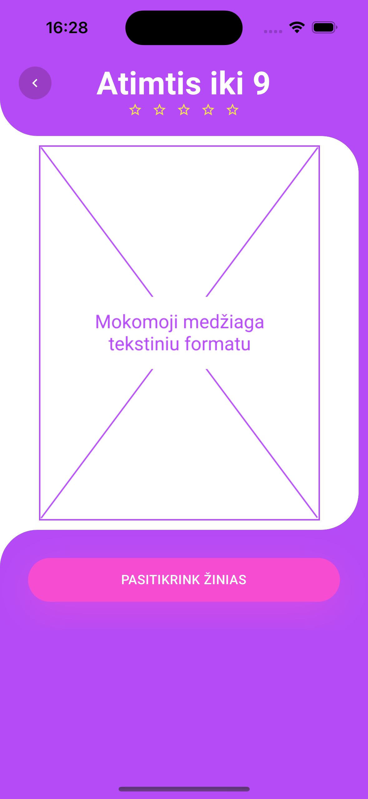

# vu-bakalauras

<p align="center">
  
</p>

Pagrindinis baigiamojo darbo tikslas – sukurti adaptyvų matematikos pagrindų mokymą mobilioje programoje, kuris būtų skirtas aritmetikos veiksmų įsisavinimui pradinio ugdymo mokiniams.

Baigiamajame darbe sukurtas adaptyvaus mokymo modelis yra realizuotas programoje „Aritmetika“, kuri sėkmingai veikia iOS ir Android mobiliuosiuose įrenginiuose. Mobilioje programoje pateikiami žinių patikrinimo testai, savikontrolės testai bei mokymosi medžiaga. Mokiniai gali savarankiškai mokytis ir pasitikrinti įgytas žinias. Papildomai, mokiniai turi galimybę susimodeliuoti sprendžiamas užduotis pasirenkant operandus, veiksmus, užduočių tipus bei jų kiekį. Sukurta programa taip pat leidžia mokiniams pakviesti mokytojus, kurie gali sekti ir stebėti ugdymosi procesą. Mokytojui yra pateikiamos mokinio spręstos temos bei pasiekimų rezultatai.

# Sukurtos programos diegimas

## Android

1. Išmaniojo įrenginio interneto naršyklėje suveskite adresą https://github.com/rendertom/vu-bakalauras/releases/download/v1.0/vu-bakalauras.apk arba nuskenuokite žemiau pateiktą QR kodą ir atsisiųskite programos diegimo failą.
2. Failų naršyklėje suraskite APK failą ir pasirinkite jį.
3. Pasirodys APK diegimo meniu. Spustelėkite „Įdiegti“.
4. Palaukite, kol programa bus įdiegta.
5. Baigus diegimą, spustelėkite „Baigta“ arba „Atidaryti“.


## iOS

iOS įrenginiams diegimo failas nenumatytas. Norint pasileisti programą, reikės ją susikompiliuoti ir macOS kompiuteryje pasileisti Simulator programą.

# Developement

## Būtinosios sąlygos

- [Node.js](https://nodejs.org/en)

## Veiksmai

Atsisiųskite repozitoriją ir sekite sekančius veiksmus:

```bash
# Watchman diegimas (skirtas tik macOS)
brew update
brew install watchman

# atsidarykite projekto katalogą
cd path/to/vu-bakalauras

# įdiekite projekto priklausomybes
npm install

# paleiskite "Expo" serverį
npm run start
```

- Norint paleisti programą iOS simuliatoriuje, tam jums reikės papildomai įsidiegti [Xcode](https://developer.apple.com/xcode/)
- Norint paleisti programą Android emuliatoriuje, tam jums reikės papildomai įsidiegti [Android Studio](https://developer.android.com/studio)

# Screesnhots

</img>
</img>
</img>
</img>
</img>
</img>
